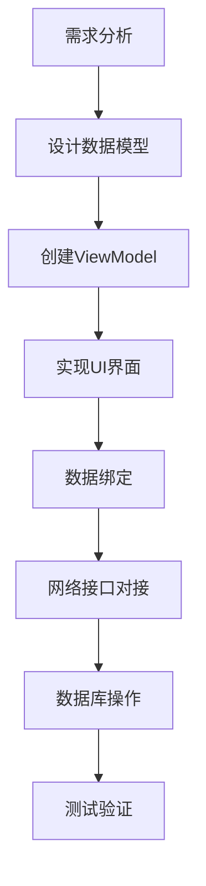

# BaiduFM-Swift 项目学习文档

## 项目概述

BaiduFM-Swift 是一个使用 Swift 语言开发的百度FM客户端，采用现代化的iOS开发架构和技术栈。项目支持iOS、macOS、tvOS和watchOS多平台，使用Swift Package Manager进行依赖管理。

### 主要功能特性
- 🎵 在线音乐播放和流媒体
- 📱 Apple Watch支持（歌词同步显示）
- 💾 歌曲本地下载和管理
- ❤️ 收藏音乐管理
- 📜 播放历史记录
- 🎤 歌词自动滚动显示
- 🔄 下拉刷新和上拉加载
- 🎛️ 后台播放和锁屏控制
- 📂 音乐分类浏览

## 项目架构分析

### 1. 整体架构模式

项目采用 **MVVM + 响应式编程** 架构模式：

```
┌─────────────────┐    ┌─────────────────┐    ┌─────────────────┐
│      View       │◄──►│   ViewModel     │◄──►│     Model       │
│   (UI Layer)    │    │ (Logic Layer)   │    │  (Data Layer)   │
└─────────────────┘    └─────────────────┘    └─────────────────┘
         ▲                       ▲                       ▲
         │                       │                       │
    ┌────▼────┐            ┌────▼────┐            ┌────▼────┐
    │RxCocoa  │            │RxSwift  │            │Network  │
    │Bindings │            │Reactive │            │Database │
    └─────────┘            └─────────┘            └─────────┘
```

### 2. 目录结构详解

```
BaiduFM-Swift/
├── Package.swift                 # Swift Package Manager配置
├── Sources/
│   ├── BaiduFM/                 # 主要源码目录
│   │   ├── AppDelegate.swift    # 应用程序入口和配置
│   │   ├── Model/               # 数据模型层
│   │   │   ├── DataCenter.swift      # 数据中心（单例，响应式数据管理）
│   │   │   ├── PlayerViewModel.swift # 播放器视图模型
│   │   │   ├── Song.swift            # 歌曲数据模型
│   │   │   └── Channel.swift         # 频道数据模型
│   │   ├── Views/               # 视图层
│   │   │   ├── Modern/               # 现代化UI组件
│   │   │   │   └── BaseViewController.swift # 基础视图控制器
│   │   │   ├── ViewController.swift          # 主视图控制器
│   │   │   ├── MusicListTableViewController.swift # 音乐列表
│   │   │   ├── ChannelTableViewController.swift   # 频道列表
│   │   │   ├── LikeTableViewController.swift      # 收藏列表
│   │   │   ├── RecentTableViewController.swift    # 最近播放
│   │   │   └── DownloadTableViewController.swift  # 下载列表
│   │   ├── Common/              # 通用工具和管理器
│   │   │   ├── Common.swift          # 通用工具类
│   │   │   ├── NetworkManager.swift  # 网络请求管理器
│   │   │   ├── AudioManager.swift    # 音频播放管理器
│   │   │   ├── DownloadManager.swift # 下载管理器
│   │   │   ├── LyricsManager.swift   # 歌词管理器
│   │   │   ├── HttpRequest.swift     # HTTP请求封装
│   │   │   ├── Utils.swift           # 实用工具
│   │   │   └── Const.swift           # 常量定义
│   │   ├── DataBase/            # 数据库层
│   │   │   ├── DatabaseManager.swift # 数据库管理器
│   │   │   └── SongList.swift        # 歌曲列表数据库操作
│   │   └── Images.xcassets/     # 图片资源
│   └── Libs/                    # 第三方库
│       └── fmdb/                # SQLite数据库封装
├── Tests/                       # 测试代码
└── ScreenShot/                  # 项目截图
```

### 3. 核心技术栈

#### 依赖库分析
```swift
// 网络层
- Alamofire: HTTP网络请求库
- SwiftyJSON: JSON数据解析

// 响应式编程
- RxSwift: 响应式编程框架
- RxCocoa: RxSwift的UIKit扩展

// UI层
- SnapKit: AutoLayout DSL
- Kingfisher: 图片缓存和加载
- MJRefresh: 下拉刷新组件
- LTMorphingLabel: 文字动画效果

// 数据层
- SQLite.swift: 类型安全的SQLite ORM
- FMDB: SQLite数据库封装（C桥接）

// 工具库
- Async: 异步编程简化
```

## 核心组件详解

### 1. DataCenter（数据中心）

**职责**: 全局数据状态管理，采用单例模式 + 响应式编程

```swift
// 核心响应式属性
let channelListInfo = BehaviorRelay<[Channel]>(value: [])     // 频道列表
let currentChannel = BehaviorRelay<Channel?>(value: nil)      // 当前频道
let currentPlayingSong = BehaviorRelay<Song?>(value: nil)     // 当前播放歌曲
let likedSongs = BehaviorRelay<[Song]>(value: [])            // 收藏歌曲
let recentSongs = BehaviorRelay<[Song]>(value: [])           // 最近播放
let downloadedSongs = BehaviorRelay<[Song]>(value: [])       // 已下载歌曲
```

**特点**:
- 使用 `BehaviorRelay` 实现响应式数据绑定
- 自动保存用户偏好设置到 UserDefaults
- 统一管理所有业务数据状态

### 2. BaseViewController（基础视图控制器）

**职责**: 提供统一的UI状态管理和通用功能

```swift
// UI状态管理
enum ViewState {
    case loading    // 加载中
    case content    // 显示内容  
    case empty      // 空状态
    case error      // 错误状态
}
```

**功能**:
- 统一的加载、错误、空状态显示
- 响应式UI状态绑定
- 导航栏样式配置
- Toast提示功能

### 3. 管理器组件

#### NetworkManager（网络管理器）
- 基于 Alamofire 封装
- 提供响应式网络请求接口
- 统一错误处理和数据解析

#### AudioManager（音频管理器）
- 音频播放控制
- 后台播放支持
- 远程控制事件处理
- 播放状态管理

#### DownloadManager（下载管理器）
- 歌曲下载队列管理
- 下载进度跟踪
- 本地文件管理

#### DatabaseManager（数据库管理器）
- SQLite数据库初始化
- 数据库版本管理
- 事务处理

## 如何新建功能

### 1. 功能开发流程



### 2. 具体开发步骤

#### 步骤1: 创建数据模型
```swift
// 在 Sources/BaiduFM/Model/ 目录下创建新的数据模型
struct NewFeatureModel {
    let id: String
    let name: String
    let description: String
    // 其他属性...
}
```

#### 步骤2: 扩展DataCenter
```swift
// 在 DataCenter.swift 中添加新功能的响应式属性
class DataCenter {
    // 新功能数据
    let newFeatureData = BehaviorRelay<[NewFeatureModel]>(value: [])
    
    // 加载新功能数据的方法
    func loadNewFeatureData() -> Observable<Void> {
        return NetworkManager.shared.getNewFeatureData()
            .do(onNext: { [weak self] data in
                self?.newFeatureData.accept(data)
            })
            .map { _ in () }
    }
}
```

#### 步骤3: 创建ViewModel
```swift
// 在 Sources/BaiduFM/Model/ 目录下创建ViewModel
class NewFeatureViewModel {
    private let disposeBag = DisposeBag()
    private let dataCenter = DataCenter.shared
    
    // 输入
    let refreshTrigger = PublishRelay<Void>()
    
    // 输出
    let items: Driver<[NewFeatureModel]>
    let isLoading: Driver<Bool>
    let error: Driver<String?>
    
    init() {
        // 实现响应式逻辑绑定
        let loadingRelay = BehaviorRelay<Bool>(value: false)
        let errorRelay = BehaviorRelay<String?>(value: nil)
        
        // 刷新触发器
        refreshTrigger
            .do(onNext: { _ in loadingRelay.accept(true) })
            .flatMapLatest { _ in
                dataCenter.loadNewFeatureData()
                    .catch { error in
                        errorRelay.accept(error.localizedDescription)
                        return .empty()
                    }
            }
            .do(onNext: { _ in loadingRelay.accept(false) })
            .subscribe()
            .disposed(by: disposeBag)
        
        // 输出绑定
        items = dataCenter.newFeatureData.asDriver()
        isLoading = loadingRelay.asDriver()
        error = errorRelay.asDriver()
    }
}
```

#### 步骤4: 创建视图控制器
```swift
// 在 Sources/BaiduFM/Views/ 目录下创建新的视图控制器
class NewFeatureViewController: BaseViewController {
    
    // MARK: - 属性
    private let viewModel = NewFeatureViewModel()
    
    // MARK: - UI组件
    private lazy var tableView: UITableView = {
        let tableView = UITableView()
        tableView.delegate = self
        tableView.dataSource = self
        tableView.register(UITableViewCell.self, forCellReuseIdentifier: "Cell")
        return tableView
    }()
    
    // MARK: - 生命周期
    override func viewDidLoad() {
        super.viewDidLoad()
        setupUI()
        setupBindings()
    }
    
    // MARK: - UI设置
    private func setupUI() {
        title = "新功能"
        view.addSubview(tableView)
        
        tableView.snp.makeConstraints { make in
            make.edges.equalToSuperview()
        }
    }
    
    // MARK: - 数据绑定
    private func setupBindings() {
        // 视图出现时触发数据加载
        rx.viewWillAppear
            .take(1)
            .bind(to: viewModel.refreshTrigger)
            .disposed(by: disposeBag)
        
        // 绑定数据到UI
        viewModel.items
            .drive(onNext: { [weak self] _ in
                self?.tableView.reloadData()
                self?.showContent()
            })
            .disposed(by: disposeBag)
        
        // 绑定加载状态
        viewModel.isLoading
            .drive(onNext: { [weak self] isLoading in
                if isLoading {
                    self?.showLoading()
                }
            })
            .disposed(by: disposeBag)
        
        // 绑定错误状态
        viewModel.error
            .compactMap { $0 }
            .drive(onNext: { [weak self] error in
                self?.showError(message: error)
            })
            .disposed(by: disposeBag)
    }
    
    // MARK: - 重试处理
    override func onRetryTapped() {
        viewModel.refreshTrigger.accept(())
    }
}

// MARK: - TableView数据源和代理
extension NewFeatureViewController: UITableViewDataSource, UITableViewDelegate {
    func tableView(_ tableView: UITableView, numberOfRowsInSection section: Int) -> Int {
        return viewModel.items.value.count
    }
    
    func tableView(_ tableView: UITableView, cellForRowAt indexPath: IndexPath) -> UITableViewCell {
        let cell = tableView.dequeueReusableCell(withIdentifier: "Cell", for: indexPath)
        let item = viewModel.items.value[indexPath.row]
        cell.textLabel?.text = item.name
        cell.detailTextLabel?.text = item.description
        return cell
    }
}
```

#### 步骤5: 网络接口扩展
```swift
// 在 NetworkManager.swift 中添加新的网络请求方法
extension NetworkManager {
    func getNewFeatureData() -> Observable<[NewFeatureModel]> {
        let url = "https://api.example.com/new-feature"
        
        return request(url: url, method: .get)
            .map { json in
                // 解析JSON数据
                return json["data"].arrayValue.compactMap { item in
                    NewFeatureModel(
                        id: item["id"].stringValue,
                        name: item["name"].stringValue,
                        description: item["description"].stringValue
                    )
                }
            }
    }
}
```

#### 步骤6: 数据库操作（如需要）
```swift
// 在 Sources/BaiduFM/DataBase/ 目录下创建数据库操作类
class NewFeatureDatabase {
    private let dbManager = DatabaseManager.shared
    
    func saveNewFeatureData(_ data: [NewFeatureModel]) {
        // 实现数据库保存逻辑
    }
    
    func loadNewFeatureData() -> [NewFeatureModel] {
        // 实现数据库读取逻辑
        return []
    }
}
```

### 3. 开发最佳实践

#### 代码规范
1. **命名规范**: 使用驼峰命名法，类名首字母大写，变量和方法首字母小写
2. **注释规范**: 使用中文注释，说明类、方法的功能和用途
3. **文件组织**: 按功能模块组织文件，保持目录结构清晰

#### 响应式编程规范
1. **使用 BehaviorRelay**: 用于状态管理和数据绑定
2. **使用 Driver**: 用于UI绑定，确保在主线程执行
3. **正确使用 DisposeBag**: 避免内存泄漏

#### UI开发规范
1. **继承 BaseViewController**: 获得统一的状态管理功能
2. **使用 SnapKit**: 进行AutoLayout约束设置
3. **响应式UI绑定**: 使用RxCocoa进行UI数据绑定

#### 错误处理
1. **统一错误处理**: 在ViewModel层处理业务错误
2. **用户友好提示**: 使用BaseViewController的错误显示功能
3. **重试机制**: 实现网络请求失败的重试功能

### 4. 测试指南

#### 单元测试
```swift
// 在 Tests/BaiduFMTests/ 目录下创建测试文件
import XCTest
import RxTest
import RxSwift
@testable import BaiduFM

class NewFeatureViewModelTests: XCTestCase {
    var viewModel: NewFeatureViewModel!
    var scheduler: TestScheduler!
    var disposeBag: DisposeBag!
    
    override func setUp() {
        super.setUp()
        scheduler = TestScheduler(initialClock: 0)
        disposeBag = DisposeBag()
        viewModel = NewFeatureViewModel()
    }
    
    func testLoadData() {
        // 实现测试逻辑
    }
}
```

## 项目运行和调试

### 1. 环境要求
- Xcode 14.0+
- iOS 13.0+
- Swift 5.7+

### 2. 运行步骤
```bash
# 1. 克隆项目
git clone https://github.com/belm/BaiduFM-Swift.git

# 2. 进入项目目录
cd BaiduFM-Swift

# 3. 使用Xcode打开项目
open Package.swift

# 4. 等待依赖下载完成后运行项目
```

### 3. 调试技巧
1. **使用断点**: 在关键代码处设置断点进行调试
2. **日志输出**: 使用 `print()` 输出调试信息
3. **响应式调试**: 使用 `.debug()` 操作符调试RxSwift流
4. **网络调试**: 使用Charles或Proxyman抓包调试网络请求

## 总结

BaiduFM-Swift项目采用现代化的iOS开发架构，具有以下特点：

### 优势
- ✅ **架构清晰**: MVVM + 响应式编程，职责分离明确
- ✅ **技术先进**: 使用最新的Swift特性和第三方库
- ✅ **可维护性强**: 统一的代码规范和组件化设计
- ✅ **扩展性好**: 基于协议和泛型的设计，易于扩展新功能

### 学习价值
- 📚 **响应式编程**: 学习RxSwift在实际项目中的应用
- 📚 **架构设计**: 理解MVVM架构在iOS开发中的实践
- 📚 **组件化开发**: 学习如何设计可复用的UI组件
- 📚 **数据管理**: 掌握本地数据库和网络数据的统一管理

通过学习这个项目，可以掌握现代iOS开发的核心技术和最佳实践，为开发高质量的iOS应用打下坚实基础。 